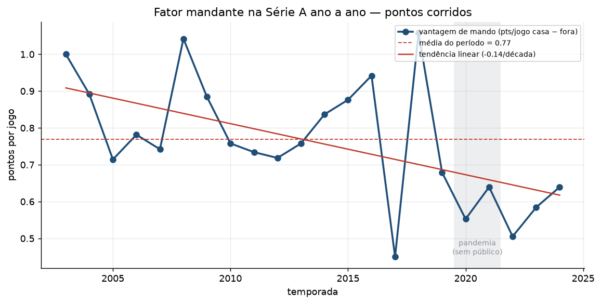
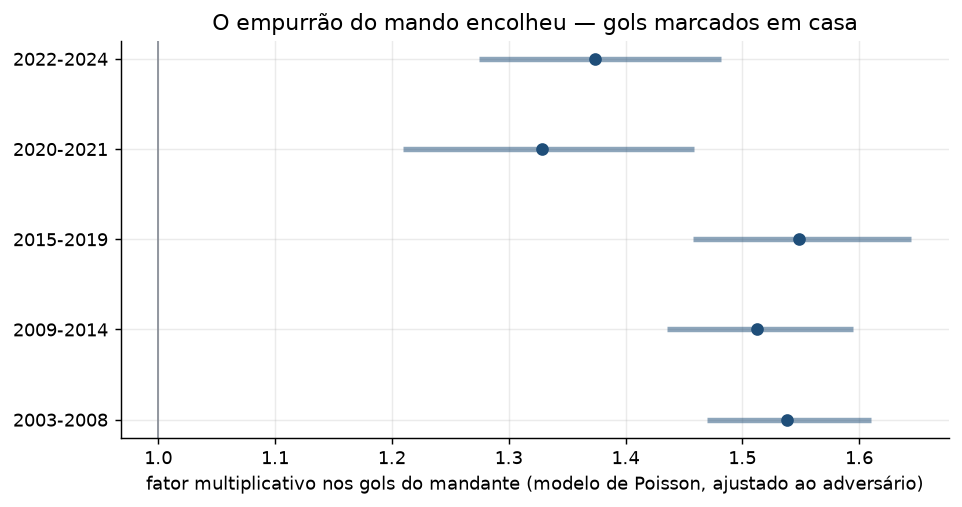
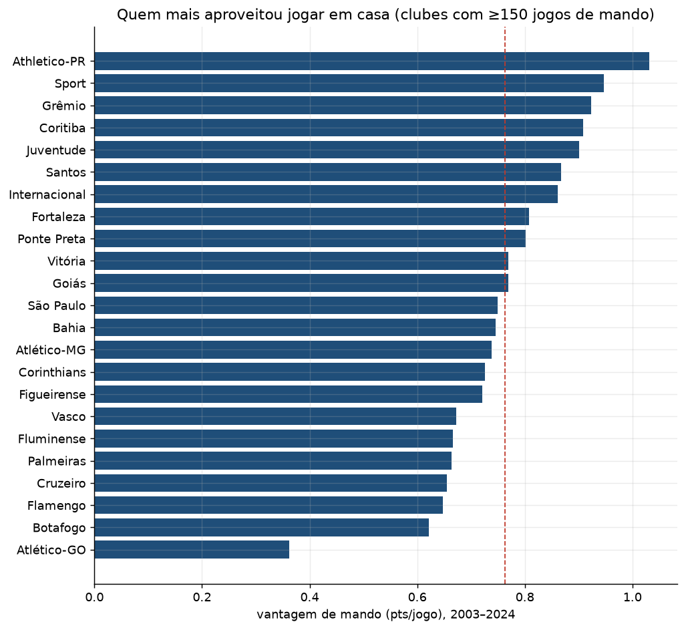
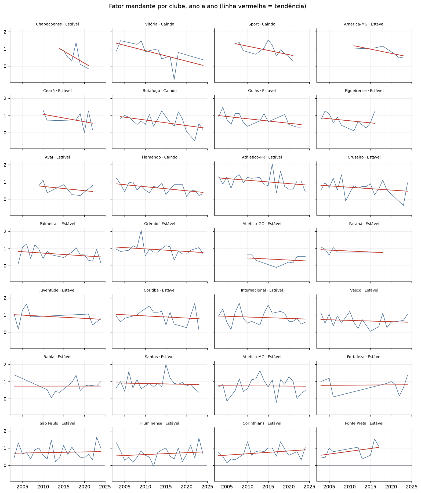
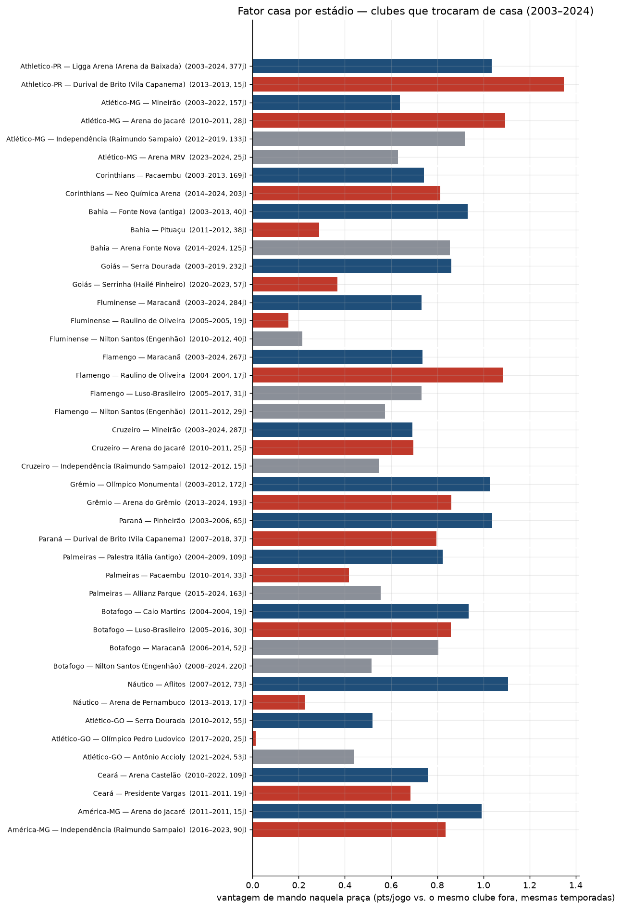

# 01 — Fator mandante e fator casa na Série A (2003–2024)

[English](README.en.md)

## A pergunta

Quanto jogar em casa valeu para os clubes da Série A na era dos pontos corridos?
E, separando duas coisas que costumam ser tratadas como uma só:

- **Fator mandante** — o efeito de ter o mando de campo, seja onde for.
  Mandante × visitante.
- **Fator casa** — o efeito de mandar **naquele estádio específico**. Faz
  diferença porque vários clubes trocaram de casa no período: o Corinthians
  mandou no Morumbi, no Pacaembu e desde 2014 na Arena em Itaquera; o Palmeiras
  saiu do Palestra Itália, passou pelo Pacaembu e pelo Barueri e foi para o
  Allianz; o Grêmio trocou o Olímpico pela Arena; o Atlético-MG rodou entre
  Mineirão, Independência e Arena MRV.

Para cada um dos dois, a análise entrega três recortes: **agregado** (todas as
edições somadas), **ano a ano** e **tendência** — se o fator subiu ou caiu para
cada clube ao longo do tempo.

## Como foi medido

Base: `data/processed/time_jogo.parquet` (duas linhas por jogo, uma por clube).
Todas as métricas são **por jogo**, para comparar edições com número de rodadas
diferente.

- **Split descritivo** — pontos por jogo (ppg) como mandante contra ppg como
  visitante. A diferença é a `vantagem_ppg`. Também `share_pts_casa`
  = pontos em casa ÷ (pontos em casa + fora); 0,5 seria "sem vantagem nenhuma".
- **Modelo de Poisson de gols** (`src/futebrasil/modelos.py`) — para o número
  ajustado à força dos times. Cada partida vira duas linhas; os gols marcados são
  modelados por `gols ~ ataque do time + defesa do adversário + mando`, com
  dummies de clube. O coeficiente de `mando`, exponenciado, é o **fator
  multiplicativo nos gols** de quem joga em casa, já descontada a qualidade dos
  dois lados. Rodado em janelas de temporadas para ver o efeito mudar.
- **Tendência** (`src/futebrasil/tendencia.py`) — para cada clube, uma reta por
  mínimos quadrados ponderados (peso = nº de jogos de mando no ano) da
  `vantagem_ppg` contra a temporada. A classificação usa o IC 95% da inclinação:
  **Subindo** (IC todo positivo), **Caindo** (IC todo negativo), **Estável** (IC
  cruza o zero).
- **Fator casa por estádio** — entre os jogos de mando na casa principal de cada
  temporada, agrupa por (clube, estádio). A linha de base é o desempenho do mesmo
  clube como **visitante nas mesmas temporadas** — controle simples para força de
  elenco e época. `vantagem_ppg` aqui é a vantagem **marginal** (casa − fora),
  não a força bruta em casa.

Fora do recorte: 2001 e 2002 (tinham mata-mata). Detalhes de fonte, validação e
limitações em [../../data/README.md](../../data/README.md).

## Fator mandante — agregado

Somando 2003 a 2024 (8.785 jogos):

| | mandante | visitante |
|---|---:|---:|
| pontos por jogo | **1,75** | 0,98 |
| % de vitória | 49,6% | 24,0% |
| gols por jogo | 1,54 | 1,03 |

O mandante ficou com **64,1% dos pontos** em disputa. Pelo modelo de Poisson,
joga-se em casa e marca-se **1,49× mais gols** (IC 95% 1,46–1,54), ajustando pela
força do adversário.

## Fator mandante — ano a ano

A vantagem bruta oscila bastante de ano para ano, mas a inclinação é negativa:
cerca de **−0,14 ponto por jogo por década**. Dois anos fogem da curva — 2017
(vantagem de só 0,45, a menor da série) e 2018 (1,06, a maior). O modelo conta a
mesma história com menos ruído:

O fator de gols fica em torno de **1,54 de 2003 a 2019** e cai para **1,33 em
2020–2021** e **1,37 em 2022–2024**. Os intervalos de confiança das duas últimas
janelas não encostam nos das anteriores — a queda é real, não flutuação.

### Sem público (pandemia)

Nos jogos sem torcida de 2020–2021, a vantagem bruta caiu de ~0,79 ppg (com
público) para **0,55**. No modelo, a interação `mando × sem_publico` dá fator
**0,87** (p = 0,04): jogar sem torcida corta cerca de **13% do empurrão de gols**
do mandante. O efeito não some — parte do fator mandante é campo conhecido,
viagem do adversário e escala de arbitragem —, mas encolhe de forma mensurável.

## Fator mandante — por clube

No agregado (clubes com ≥150 jogos de mando), **Athletico-PR** lidera com folga
(+1,03 ppg), seguido de **Sport**, **Grêmio** e **Coritiba**. No fim da lista,
**Atlético-GO** (+0,36) e, entre os de amostra menor, **Cuiabá** (+0,17). O
modelo de Poisson coloca Grêmio, Sport, Fortaleza e Athletico-PR como os que mais
inflam o ataque em casa.

Boa parte da vantagem dos clubes do topo vem de jogarem **muito mal como
visitantes** (Paysandu, Guarani e Portuguesa, todos com poucas temporadas na
elite, têm as maiores diferenças justamente por isso), então o ranking bruto
mistura "fortaleza em casa" com "frangueiro fora".

## Fator mandante — tendência por clube

De 28 clubes com pelo menos 6 temporadas, **24 ficam como "Estável"** e **4 como
"Caindo"** (Vitória, Sport, Botafogo, Flamengo). **Nenhum "Subindo".** Ou seja: a
queda do fator mandante é um fenômeno de **liga**; no nível de clube, 15 a 22
temporadas de dados ruidosos não bastam para cravar uma tendência individual na
maioria dos casos. A direção, porém, é consistente — as inclinações se
concentram no lado negativo.

## Fator casa — por estádio

Lendo como vantagem **marginal** (ppg em casa − ppg fora, mesmas temporadas):

| Clube | Praça | Período | Jogos | Vantagem (ppg) |
|---|---|---|---:|---:|
| Corinthians | Pacaembu | 2003–2013 | 169 | 0,74 |
| Corinthians | Neo Química Arena | 2014–2024 | 203 | **0,81** |
| Grêmio | Olímpico | 2003–2012 | 172 | **1,03** |
| Grêmio | Arena do Grêmio | 2013–2024 | 193 | 0,86 |
| Palmeiras | Palestra Itália | 2004–2009 | 109 | **0,82** |
| Palmeiras | Pacaembu (exílio) | 2010–2014 | 33 | 0,42 |
| Palmeiras | Allianz Parque | 2015–2024 | 163 | 0,56 |
| Atlético-MG | Mineirão | 2003–2022 | 157 | 0,64 |
| Atlético-MG | Independência | 2012–2019 | 133 | **0,92** |
| Atlético-MG | Arena MRV | 2023–2024 | 25 | 0,63 |
| Bahia | Arena Fonte Nova | 2014–2024 | 125 | 0,85 |
| Bahia | Pituaçu (interino) | 2011–2012 | 38 | 0,29 |

Alguns padrões:

- **Corinthians** ganhou um pouco mais de vantagem na Arena do que tinha no
  Pacaembu (+0,81 contra +0,74).
- **Grêmio** rendia mais no Olímpico (+1,03) do que rende na Arena (+0,86) — mas
  parte disso é o Grêmio recente ter melhorado como visitante.
- **Palmeiras** tem a menor vantagem marginal justo no Allianz. Não é que o time
  jogue mal lá (2,10 ppg em casa) — é que o Palmeiras dos últimos anos também
  pontua muito fora (1,54 ppg), então a **diferença** encolhe. O período de
  exílio no Pacaembu foi de fato ruim (+0,42).
- **Independência** confirma a fama de fortaleza do Atlético-MG: +0,92, acima do
  Mineirão (+0,64) e da Arena MRV nos dois primeiros anos (+0,63).
- Estádios interinos (Pituaçu para o Bahia, Pacaembu para o Palmeiras) rendem
  bem menos que a casa "de verdade" — o efeito casa depende de ser a casa.

A tabela completa, com todos os clubes e estádios (≥15 jogos de mando), está em
[outputs/tables/fator_casa_por_estadio.csv](outputs/tables/fator_casa_por_estadio.csv).
A inclinação da vantagem dentro de cada estádio está em
`tendencia_por_clube_estadio.csv`.

## Ressalvas

- O split descritivo **não** controla força do adversário; o modelo de Poisson
  controla, e conta a mesma história.
- `vantagem_ppg` do fator casa é marginal — um clube que ficou bom como
  visitante aparece com vantagem menor mesmo mandando bem.
- Amostras pequenas (estádios interinos, clubes com poucas temporadas) têm
  intervalos largos; a coluna `n_jogos` está em todas as tabelas.
- Janela sem público é aproximada (ver [../../data/README.md](../../data/README.md)).

## Arquivos

- `run.py` — gera tudo abaixo.
- `outputs/tables/` — `agregado_liga`, `agregado_por_clube`, `ano_a_ano_liga`,
  `ano_a_ano_por_clube`, `tendencia_por_clube`, `fator_casa_por_estadio`,
  `tendencia_por_clube_estadio`, `modelo_efeito_mando_janela`,
  `modelo_efeito_mando_por_clube`, `modelo_efeito_mando_sem_publico`.
- `outputs/figures/` — as 5 figuras acima.
