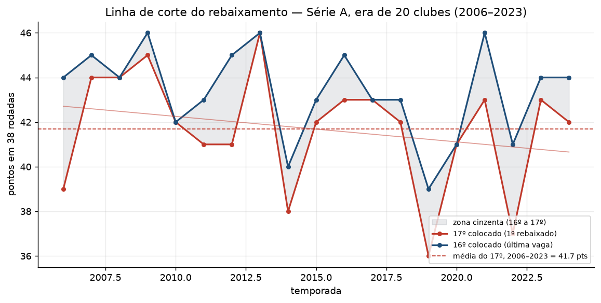
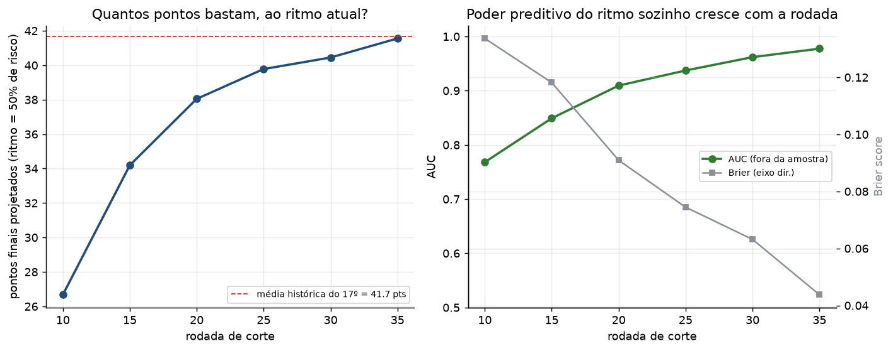
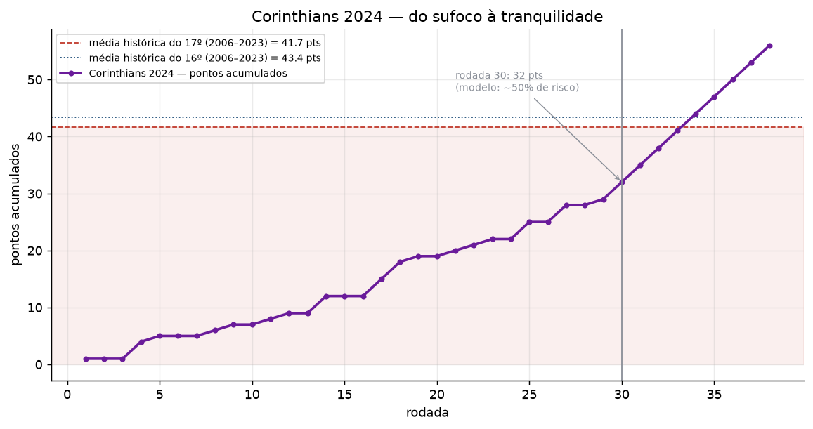
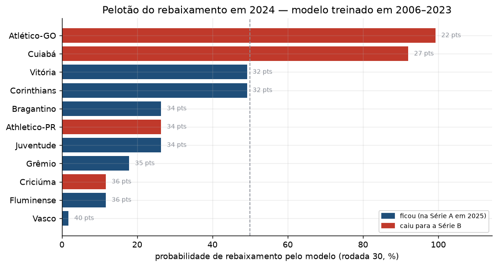

# 02 — The relegation safety line and points pace (2006–2024)

[Português](README.md)

## The question

Historically, how many points are enough to survive relegation in Série A? And
mid-season — while a club still doesn't know if it will be safe — can "pace so
far" be turned into an actual probability of going down, instead of loose
min/average/max projections?

The trigger was Corinthians' 2024 campaign: 32 points in 30 rounds, the club's
worst mark in the round-robin era up to that point. Rather than treating this as
a question about one club in one season, the analysis is built to be general —
meant to hold for any team, at any round — and uses 2024 as the closing case
study.

## Scope

Série A, **20-club / 38-round / 4-relegated era**, i.e. **2006 onward**. 2003
(24 clubs) and 2004–2005 (24 and 22 clubs) had different promotion/relegation
formats and are excluded — details in
[../../data/README.md](../../data/README.md).

## How it was measured

Two approaches that cross-check each other:

- **Safety line (descriptive)** — points of the **16th-placed** club (last
  surviving spot) and the **17th-placed** club (first relegated) at the end of
  each season, reconstructed round by round from
  `data/processed/time_jogo.parquet` with the same standings logic used to
  validate champions (`src/futebrasil/validacao.py`: points, wins, goal
  difference, goals scored). Trend over the years via weighted least squares
  (the same routine used in analysis 01's `src/futebrasil/tendencia.py`, now
  exposed as `ajustar_reta` for reuse).
- **Pace model (logistic regression)** — for every season from 2006 to 2023 and
  every club, we compute cumulative points at fixed checkpoint rounds (10, 15,
  20, 25, 30, 35) and whether the club finished among the bottom 4. At each
  checkpoint round, we fit

  `relegated ~ points per game accumulated so far`

  via logistic regression (`src/futebrasil/permanencia.py`). One model per
  round, not a single regression with a round×pace interaction — the question
  that matters is always local ("given I'm at round R, at this pace, what's the
  chance?"), and fitting per round avoids having to impose a functional form for
  how the pace effect changes across the season.

  The coefficient yields the **pace (points per game) at which the model
  predicts 50% risk**, converted into points projected over 38 rounds.
  Validation is **out-of-sample by season** (leave-one-season-out: each of the
  18 training seasons is held out whole, the model is refit without it and
  tested only on it) — with a single regressor and a small panel, it's the most
  direct way to check the fit generalizes. Metrics: AUC and Brier score.

2024 stays **out of training** throughout — it enters only as a model
application, at the end.

## Safety line — history

Between 2006 and 2023, the **17th-placed club** finished with **41.7 points on
average** (minimum 36 in 2019, maximum 46 in 2009/2013/2021), and the
**16th-placed club** with **43.3** — a "grey zone" of 1 to 6 points between
staying up and going down. The slope over the years is **-1.1 point per decade,
but not significant** (95% CI -3.5 to +1.2; p = 0.31): unlike the home-advantage
factor in analysis 01, here **there's no evidence of a trend** — the cost of
staying safe swings year to year without a consistent rise or fall.

## Points pace and relegation probability

The logistic model, fit cell by cell over the 2006–2023 panel, converges to the
same line as the descriptive method: round 35 projects **41.6 points** for 50%
risk — **0.1 point** away from the historical average of the 17th-placed club
(41.7). Two independent methods (direct count of final position × regression on
pace) land on essentially the same number.

The earlier in the season, the more "pace so far" overestimates the cutoff — at
round 10 the model projects only 26.7 points for 50% risk, because teams that
start the season poorly generally still have time (and statistical reasons,
like regression to the mean) to improve. Predictive power climbs along with it:
**out-of-sample AUC** goes from **0.77 at round 10** to **0.96 at round 30** and
**0.98 at round 35**, and the Brier score drops from 0.134 to 0.044 over the
same span — pace alone, with no other information, already separates who goes
down from who stays up from about the midpoint of the season on.

## Case study — Corinthians 2024

At round 30, Corinthians had **32 points** (1.067 points per game) — below both
historical averages (41.7 and 43.3) and exactly at the pace the model (trained
only on 2006–2023, with no view of 2024) classifies as **49.2% chance of
relegation**: a coin flip. From there the team took **24 points from the last 8
rounds** (3.0 points per game, title-challenger pace), finished with 56, and
ended up comfortably clear of the drop.

Looking at the whole pack at round 30 (full table in
[outputs/tables/caso_2024_rodada30.csv](outputs/tables/caso_2024_rodada30.csv)):
the model got **18 of 20 clubs** right when classifying above or below 50%
risk. The two misses are the mirror image of Corinthians — **Athletico-PR** (34
pts, 26% risk per the model) and **Criciúma** (36 pts, 12%) had a better pace
than Corinthians at the same round and still went down, because they got worse
in the second half while Corinthians got better. Accumulated pace is a good
summary of what already happened; it doesn't predict a turnaround.

## Caveats

- The model uses **a single regressor** (points pace). It leaves out squad
  strength, remaining schedule, and momentum (recent results) — deliberately,
  to isolate the question "does the scoreline so far already say something?"
  before adding any extra variable. Both case-study misses (Athletico-PR,
  Criciúma) are exactly the kind of information left out.
- With paces very spread out at later rounds (round 35: almost no team "in the
  middle" between safe and relegated), the logistic fit runs into
  quasi-separation — the coefficient is still estimated and the p-value is
  valid, but its confidence interval is wide at those rounds. Out-of-sample AUC
  and Brier remain the more reliable read on performance.
- Small panel: 18 training seasons × 20 clubs = 360 rows per checkpoint round.
  Out-of-sample validation (leave-one-season-out) exists precisely so the
  in-sample fit isn't over-trusted.
- The descriptive "safety line" looks only at final position, not points per
  game — it isn't comparable across seasons with a different format, hence the
  2006+ cutoff.

## Methodology

Logistic regression is a new methodology for this portfolio; its formulation,
assumptions, and interpretation (odds ratios, pseudo-R², out-of-sample
validation) are documented in
[statistical-methodologies](https://github.com/FelipeSantanaJ/statistical-methodologies)
— level 2 (intuition) and level 3 (full formulation). The safety-line trend
reuses the weighted-least-squares method already used in analysis 01, also
documented there.

## Files

- `run.py` — generates everything below.
- `outputs/tables/` — `linha_de_seguranca_por_temporada`,
  `tendencia_linha_de_seguranca`, `painel_ritmo_temporada_clube`,
  `modelo_ritmo_por_rodada`, `validacao_fora_da_amostra`,
  `caso_2024_rodada30`, `trajetoria_corinthians_2024`.
- `outputs/figures/` — the 4 figures above.
- `src/futebrasil/permanencia.py` — safety line, pace panel, per-round model
  fitting, out-of-sample validation.
